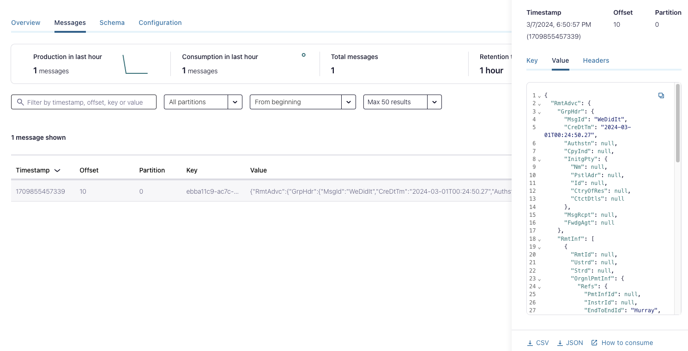

## Convert XML to AVRO and publish to Confluent Cloud.

In this Module, we will read xml messages, convert them the message into AVRO format and send the messages to Confluent Cloud topic. 


Converting to AVRO format ensures that records produced to Confluent Platform can be futher accessed by other components eg. ksqlDB, Kafka Streams application with out any compatibility issues or custom serialization.


Jakarta XML Bind API to convert XML data into a java content tree. Custom AVRO serializer is used to parse the AVRO schema from the XML annotated Java Object.  

Jackson AvroMapper with Jakarta XML Bind annotation module is used to serialize the java object and resulting bytes are sent to Confluent Cloud.

`CustomKafkaSerializer.java` and `AbstractCustomKafkaAvroSerializer.java` are modified as detailed above.

Place schema file `remittanceAdvice.xsd` and bindings file `global.xjb` in resources folder 

Refer the note on schemas and Java bindings in [schema generator module](../xml-avro-schema-generator/README.md) and update the schema and global bindings file as required.


Clone the project if you do not have it locally.

```sh
git clone https://github.com/lokeshallam/ISO20022-message-processing
```


Compile the project 

```sh
cd ProduceAndConsume_xml
mvn clean package
```


Prepare the required configuration file with connection configurations. 

eg. `cloud-config.properties`

```
# Required connection configs for Kafka producer, consumer, and admin
bootstrap.servers=<<BOOTSTRAP-URL>>
security.protocol=SASL_SSL
sasl.jaas.config=org.apache.kafka.common.security.plain.PlainLoginModule required username='<<producer-consumer-api-key>>' password='<<producer-consumer-secret>>';
sasl.mechanism=PLAIN
# Required for correctness in Apache Kafka clients prior to 2.6
client.dns.lookup=use_all_dns_ips
# Best practice for Kafka producer to prevent data loss
acks=all
# Required connection configs for Confluent Cloud Schema Registry
schema.registry.url=<<SchemaRegistry-URL>>
basic.auth.credentials.source=USER_INFO
basic.auth.user.info=<<Schema-Registry-api-key>>:<<Schema-Registry-api-secret>>
```


Run the Producer by passing the connection config file and the xml input message file.

```sh
java -cp target/produce-consume-xml-1.0.jar com.demo.examples.XmlProducer src/main/resources/cloud-config.properties src/main/resources/remittanceAdvice.xml
```

Login to Confluent cloud and validate the messages.




Run Consumer application by passing the connection config file.


```sh
java -cp target/produce-consume-xml-1.0.jar com.demo.examples.XmlConsumer src/main/resources/cloud-config.properties
```

