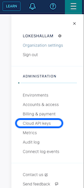
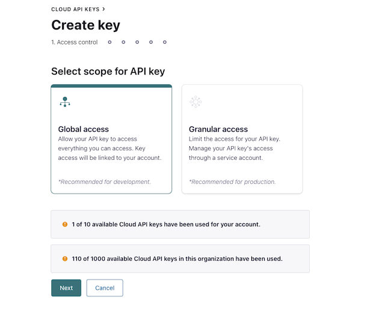
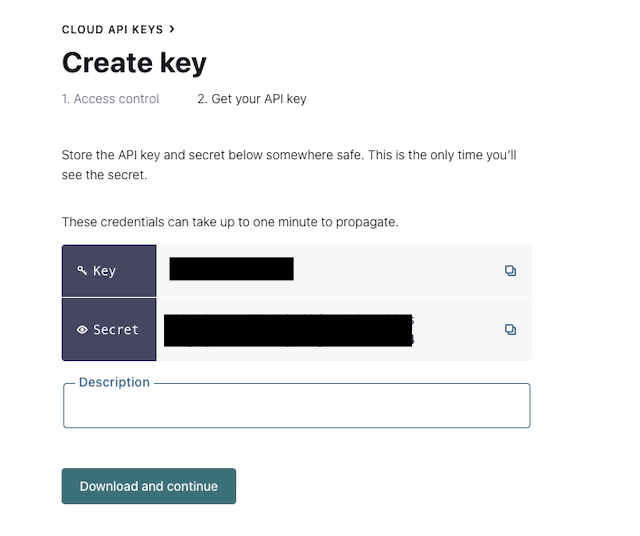

## Overview

ISO20022 is an international standard prepared by ISO Technical Committee TC68 Financial Services. It defines a common standard for financial information in payments, trade finance and securities markets.


Refer Confluent blog post [here](https://www.confluent.io/blog/payments-architecture-ISO20022-compliance/#b93491df-374c-41ae-ab3a-155c4f458174) which talks about the standard and how Confluent can accelerate the trasformation of Payments Architecture and acheive ISO20022 complaince.


XML format is not natively supported in Confluent Schema Registry by default. In this demo we will go through different ways you can handle XML data. 


## Requirements

1. Confluent Cloud

    If you don't have a Confluent Cloud account, sign up for a free trial [here](https://www.confluent.io/confluent-cloud/tryfree).

    Create Confluent Cloud API keys by following the steps in UI. Click hamburger icon that is present on the right top section and click on Cloud API Keys.

    


    In the Cloud API keys page, click Add Key.


    In Create Key page, select Global access and click Next Button.
    

    Capture the API key and secret. Provide a reasonable Description for future reference and click Download and continue button. 
    


2. Terraform 

     Please follow the instructions to install Terraform if it is not already installed on your system [here](https://developer.hashicorp.com/terraform/tutorials)

3. Export the Cloud API Key and Secret generated in Step 1 as Terraform variables.

```sh 
export TF_VAR_confluent_cloud_api_key=xxxxx
export TF_VAR_confluent_cloud_api_secret=xxxxx
```

## Module information


### [Deploy the Confluent Cloud environment using terraform](terraform/DeployClusters/README.md)

> **Note:** Gather all required details listed below if your environment is already deployed.

* Confluent cloud Environment ID : env-xxxxx

* Confluent Cloud cluster ID : lkc-xxxxxx

* Confluent Schema Registry ID : lsrc-xxxx

* Bootstrap server : pkc-xxxxxx.xx-xxxx-x.xxxx.confluent.cloud:9092

* API Key and Secret for producing and consuming

* API key and Secret for Schema Registry.

* Required Topics created in Confluent Cloud 


### [Generate AVRO Schema from XSD](xml-avro-schema-generator/README.md)

For production deployments it is recommended to register the schema ahead. An example [XSD schema](https://www.iso20022.org/message/22296/download) is used in this example to generate AVRO schema.


### [Register schema Definition](terraform/RegisterSchemaDefinition/README.md)

Confluent Provider is used to register the schema in Schema Registry. Schema Registry API key and Secret are required for this terraform module. 

You can skip this step and proceed to produce/consume module if you decide to register schema through the producer application.


### [Read messages in XML format and convert to AVRO](ProduceAndConsume_xml/README.md)

BootStrap URL, Producer & Consumer API key and Secret, Schema Registry API key and Secret are required for this module.
Follow the steps as listed in the module.


### [Produce and Consume in AVRO format](ProduceAndConsume_Avro/README.md)

This is a generic AVRO produce consume project.  


